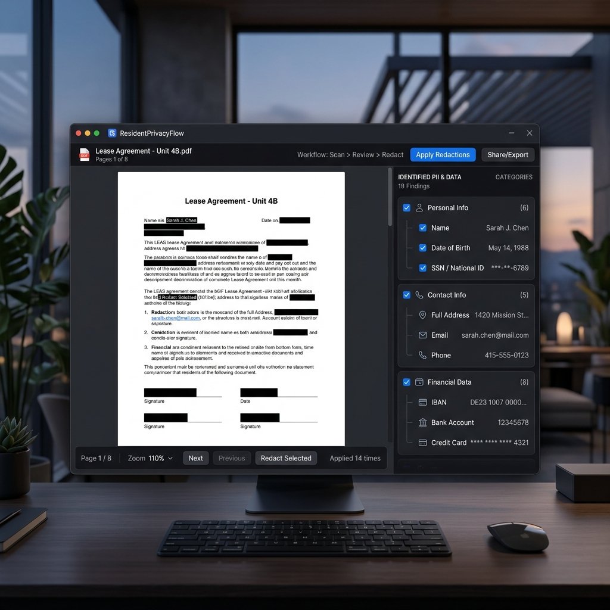

# ResidentPrivacyFlow

**Sichere, lokale PDF-Schwärzung und Pseudonymisierung für höchste Datenschutzansprüche.**



[](LICENSE)
[](https://www.electronjs.org/)
[](https://reactjs.org/)
[](https://www.typescriptlang.org/)
[](https://vitejs.dev/)

---

## 🛡️ Über das Projekt

ResidentPrivacyFlow ist eine spezialisierte Windows-Desktop-Anwendung zur Analyse, Schwärzung und Pseudonymisierung von PDF-Dokumenten. In einer Welt, in der Datenschutz an erster Stelle steht, bietet dieses Tool eine **zu 100% lokale Lösung**. Keine Daten werden jemals in die Cloud hochgeladen; alle Verarbeitungsschritte erfolgen ausschließlich auf Ihrem Endgerät (DSGVO-konform by Design).

### Warum ResidentPrivacyFlow?
- **Absoluter Datenschutz**: Keine Internetverbindung erforderlich. Ideal für hochsensible Dokumente.
- **Benutzerzentrierte UI**: Intuitive Bedienung mit Fokus auf Effizienz und Übersichtlichkeit.
- **Automatisierte Systematik**: Unterstützung beim Management von PII (Personally Identifiable Information) durch logische Gruppierung.

---

## ✨ Hauptfunktionen

- **🚀 High-Performance PDF-Viewer**: Schnelles Laden und flüssiges Navigieren durch Dokumente jeder Größe.
- **🔍 Interaktive Thumbnails**: Übersichtliche Seitenleiste für die schnelle Navigation.
- **🖊️ Präzise manuelle Schwärzung**: Markieren Sie sensible Bereiche direkt im Dokument per Drag-and-Drop.
- **🏷️ Intelligente Pseudonymisierung**: Weisen Sie Markierungen Variablen wie `Name_1`, `Adresse_1` oder `IBAN` zu.
- **📊 Strukturierter Export**: Generieren Sie detaillierte CSV-Berichte über alle vorgenommenen Änderungen und Maskierungen.
- **📦 Windows Optimiert**: Nahtlose Integration als native Desktop-Anwendung.

---

## 🛠️ Technologie-Stack

- **Frontend**: React 18 & Vite für eine moderne, reaktive Benüteroberfläche.
- **Shell**: Electron zur Bereitstellung als native Desktop-App.
- **Styling**: Vanilla CSS mit Fokus auf Performance und modernem Design.
- **PDF-Engine**: Robustes Rendering basierend auf Industriestandards.
- **Sprache**: TypeScript für maximale Typsicherheit und Wartbarkeit.

---

## 🚀 Schnellstart

### Voraussetzungen
- [Node.js](https://nodejs.org/) (Version 18 oder höher)
- [npm](https://www.npmjs.com/)

### Installation & Betrieb
```bash
# Download:
https://github.com/residentflow/residentprivacyflow/releases/download/v1.0.0/ResidentPrivacyFlow-1.0.0-x64.zip

# Entpacken
ZIP-Datei in lokalen Ordner entpacken

# Anwendung starten
ResidentPrivacyFlow.exe starten
```

### Build & Deployment
Um eine ausführbare Windows-Datei zu erstellen:
```bash
# Standard Build (ZIP & Portable)
npm run dist

# Windows Installer (EXE/MSI)
npm run dist:exe
npm run dist:msi
```
Die fertigen Programme befinden sich im Ordner `release/`.

### 🔏 Code Signing (Produktion)
Damit keine SmartScreen-Warnung ("Der Computer wurde durch Windows geschützt") erscheint, muss die App signiert werden:
1. **Zertifikat:** Ein Code Signing Zertifikat (empfohlen: EV) von einer CA erwerben.
2. **Umgebung:** `.env`-Datei erstellen (siehe `.env.example`) und Pfad/Passwort hinterlegen.
3. **Build:** `npm run dist` ausführen. Die Signierung erfolgt automatisch.

---

## 📦 Aktuelle Version & Releases

Die offizielle Release-Historie und die ausführbaren Dateien finden Sie auf der [**GitHub Releases Seite**](https://github.com/residentflow/residentprivacyflow/releases).

- **v1.0.0 (Aktuell)**: Initiale Veröffentlichung mit vollem Funktionsumfang für PDF-Anzeige, Schwärzung und CSV-Export.
- **Formate**: 
  - `EXE` (Setup): Einfache Installation für Windows.
  - `MSI` (Enterprise Installer): Für die IT-Verteilung.
  - `ZIP` (Portable Version): Herunterladen, **entpacken** und direkt starten (keine Installation erforderlich).

Weitere Details zu den Änderungen finden Sie im [**CHANGELOG.md**](CHANGELOG.md).

---

## 📝 Dokumentation & Beteiligung

- [**DEVELOPMENT.md**](DEVELOPMENT.md): Architektur-Diagramme, interne Abläufe und Tooling.
- [**CONTRIBUTING.md**](CONTRIBUTING.md): Wie Sie zum Projekt beitragen können (Code-Guidelines, PRs).
- [**SECURITY.md**](SECURITY.md): Unser Versprechen für Ihre Sicherheit.
- [**LICENSE**](LICENSE): Rechtliche Informationen (MIT Lizenz).

---

## 🤝 Support

Bei Fragen oder Problemen öffnen Sie bitte ein [Issue](https://github.com/residentflow/residentprivacyflow/issues) oder kontaktieren Sie uns direkt unter [stefan@residentflow.de](mailto:stefan@residentflow.de).

---
© 2026 ResidentPrivacyFlow - Lokale Sicherheit für Ihre Dokumente.
